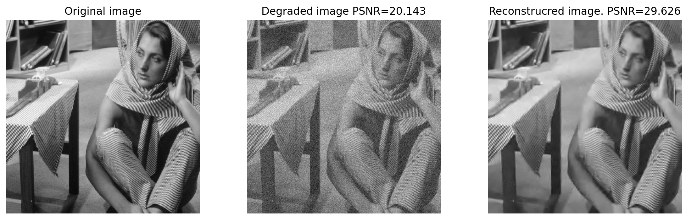

# About this Repository
This repository shows an image denoising method based on [sparse representation](https://en.wikipedia.org/wiki/Sparse_approximation) [[1](https://link.springer.com/book/10.1007/978-1-4419-7011-4), [2](https://www.edx.org/certificates/professional-certificate/israelx-sparse-representations-from-theory-to-practice)].  

  

# What Can this Tool Do?
See [main_notebook.ipynb](https://github.com/ksonod/sparse_representation_based_image_denoising/blob/main/main_notebook.ipynb) or run [main.py](https://github.com/ksonod/sparse_representation_based_image_denoising/blob/main/sample/main.py) to quickly see the outcome.   
Data processing flow is described as follows:
1. Random noise is added to an input clean image.
2. Dictionary based on direct-cosine-transform ([DCT](https://en.wikipedia.org/wiki/Discrete_cosine_transform)) is defined.
3. Coefficients of atoms in the dictionary are determined. Optinoally, it is possible to simultaneously update the dictionary itself ([dictionary learning](https://en.wikipedia.org/wiki/Sparse_dictionary_learning)).
4. A denoised image is reconstructed from the determined coefficients (and dictionary itself in the case of the dictionary learning option).
5. Denoising results are evaluated quantitatively using peak signal-to-noise ratio ([PSNR](https://en.wikipedia.org/wiki/Peak_signal-to-noise_ratio)).

# How to Use
1. Open [main.py](https://github.com/ksonod/sparse_representation_based_image_denoising/blob/main/sample/main.py) in `./sample` and specify `config` dictionaries.
2. Run `./sample/main.py`.  

# References
[[1](https://link.springer.com/book/10.1007/978-1-4419-7011-4)] M. Elad, *Sparse and Redundant Representations: From Theory to Applications in Signal and Image Processing*, Springer, 2010  
[[2](https://www.edx.org/certificates/professional-certificate/israelx-sparse-representations-from-theory-to-practice)] edx, *Sparse Representation in Signal and Image Processing*, edx.org. [Online]. Available: https://www.edx.org/certificates/professional-certificate/israelx-sparse-representations-from-theory-to-practice [Accessed: 10 April, 2021]